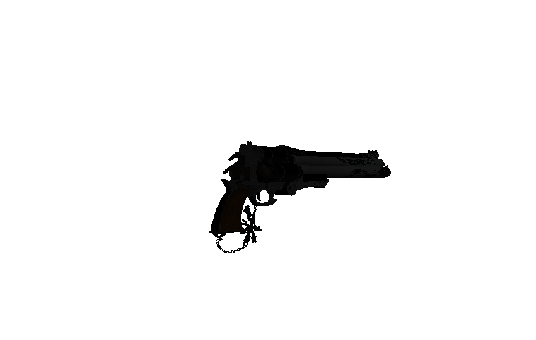
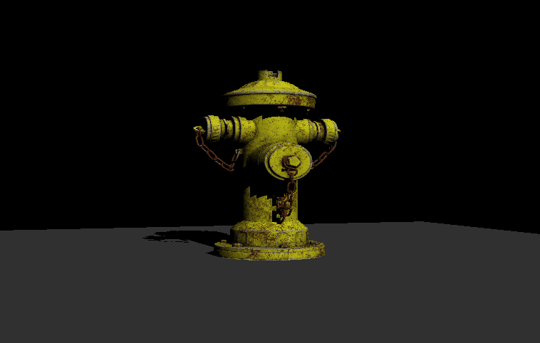

# Tiny Renderer

**Render Example**:



gun in rotating camera mode



firehydrant with floor in rotation light mode

**Build & Run**:

```bash
# install glfw, glm and rapidjson
sudo apt install libglfw3-dev libglm-dev rapidjson-dev

# build and compile
mkdir build
cd build
cmake -S .. -B .
make all

# run
./main
```

**Main Features**:

- Load one or multiple .obj models with configuration data in one .json file.
- Render the loaded data physically using the OpenGL api.
- Display the scene with different mode(camera/light rotation).

**TODO List**:

- [x] Different Display Mode(camera/light rotation)
- [x] Model/Mesh/Texture/Scene
- [x] PBR
- [x] Basic Shadow Mapping
- [ ] Soft Shadow
- [ ] FXAA
