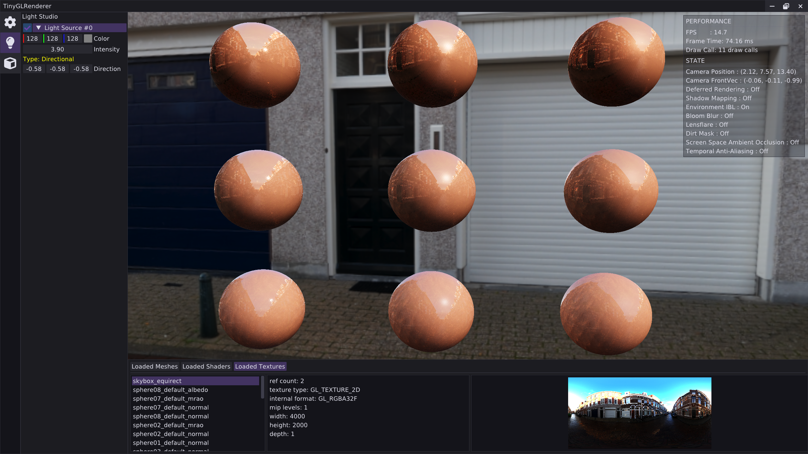
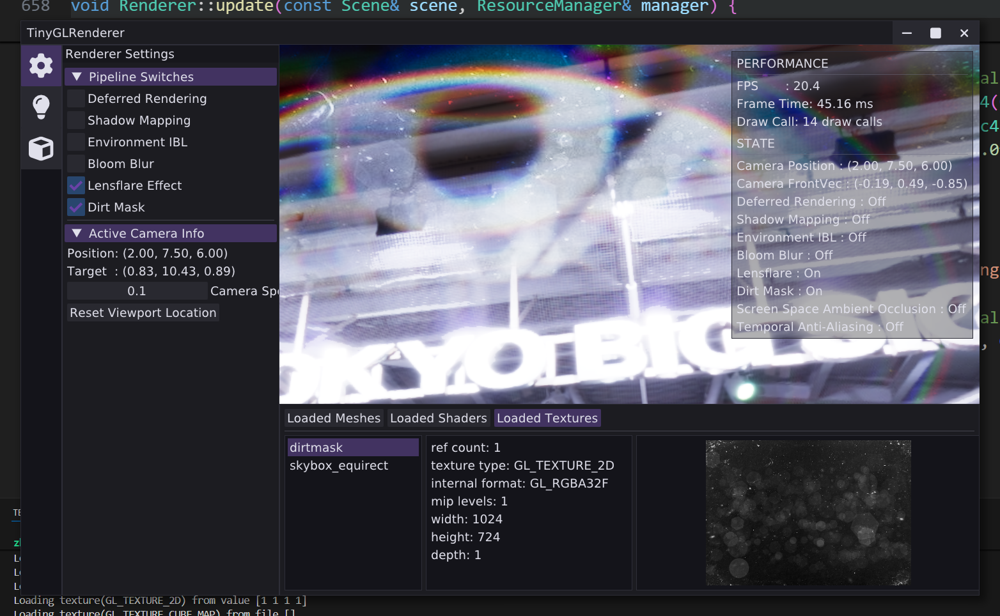
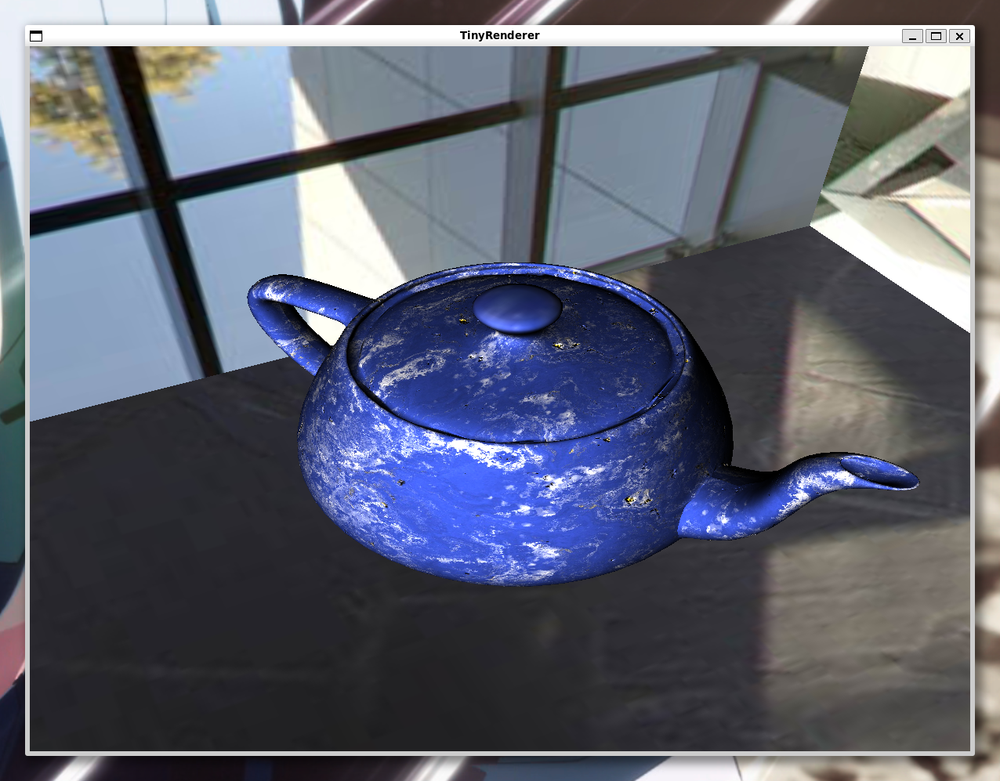
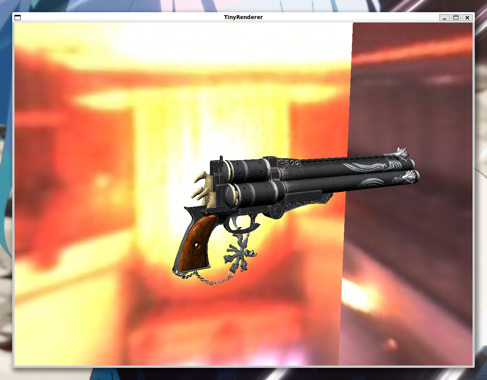
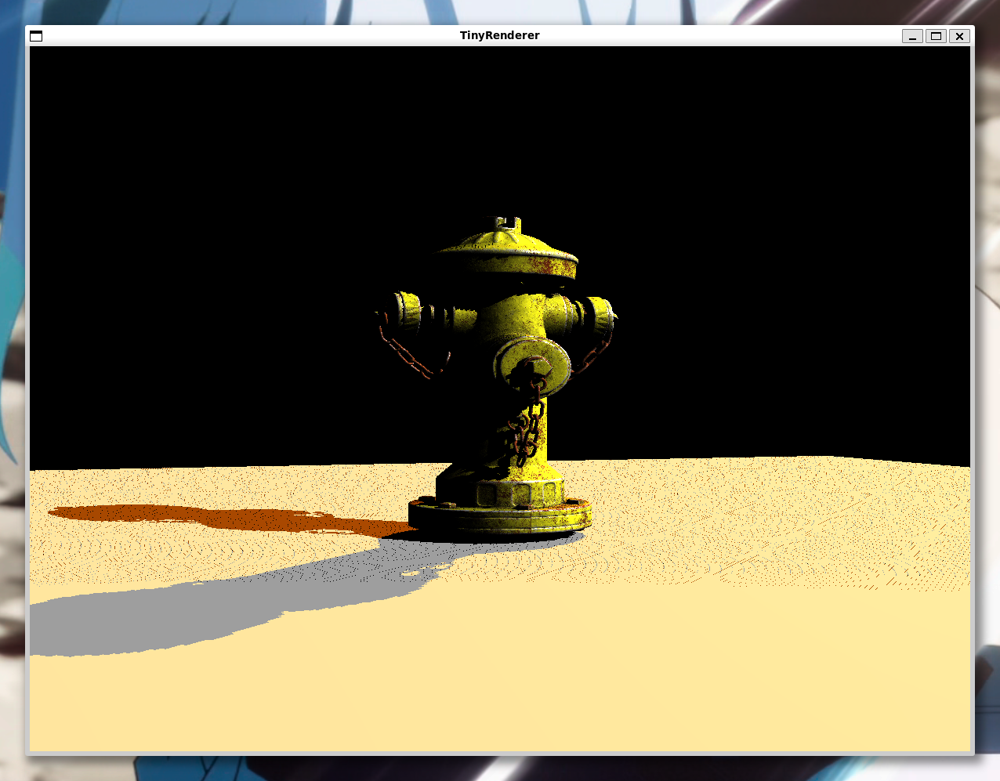

# TinyGLRenderer

A lightweight, modern OpenGL 4.5 PBR renderer built with C++17, featuring dual forward/deferred pipelines, IBL, shadow mapping, and built-in Dear ImGui editor.






## Main Features

### 📂 Scene Management

- [x] **JSON Config Loading**: Load and parse complex scene configurations dynamically from JSON files.
- [x] **.OBJ and .MTL Loading**: Support for loading and parsing .OBJ and .MTL files for 3D models and materials.

### 🎮 UI & Controls

- [x] **Heads-Up Display (HUD)**: On-screen real-time information overlay.
- [x] **Side Bar**: Interactive settings and inspector panel.
- [ ] **Resource Panel**: Display and manage loaded resources like models, materials, and textures.
- [x] **Camera & Input Control**: Intuitive navigation via keyboard and mouse(e.g., WASD for movement, right-click drag for rotation).

### 🖼️ Core Render Pipeline

- [x] **Dual Rendering Paths**: Support for both Forward and Deferred rendering pipelines.
- [x] **Physically Based Rendering (PBR)**: Realistic material shading using roughness/metallic workflows.
- [x] **Skybox Rendering**: Comprehensive background rendering supporting both traditional Cube Maps and Equirectangular HDR files.
- [x] **Image-Based Lighting (IBL)**: Realistic ambient reflections and diffuse irradiance derived from environment maps.

### 👤 Shadows & Ambient Occlusion

- [x] **Atlas Shadow Mapping**: Efficient shadow rendering utilizing a centralized shadow atlas texture.
- [ ] **Screen-Space Ambient Occlusion (SSAO)**: High-quality contact shadows and ambient shadowing based on screen-space depth.

### 🎨 Post-Processing & Cinematic Effects

- [x] **Bloom Blur**: High-quality light bleeding/glow effect for emissive surfaces.
- [x] **Lens Flare (Ghost & Halo)**: Realistic camera lens artifact simulation, including multiple ghosts and anamorphic/circular halos.
- [x] **Tone Mapping**: High-dynamic-range (HDR) to low-dynamic-range (LDR) color mapping using ACES algorithm.
- [ ] **Temporal Antialiasing (TAA)**: Reduces aliasing artifacts by combining multiple frames.
- [x] **Gamma Correction**: Linear-to-sRGB color space conversion for accurate display output.

## Get Started

### 🚀 Build & Run

```bash
# install dependencies
sudo apt install libglfw3-dev libglm-dev rapidjson-dev

# build and compile
mkdir build
cd build
cmake -S .. -B .
make all

# run
./main
```

### 🏞️ More Examples






